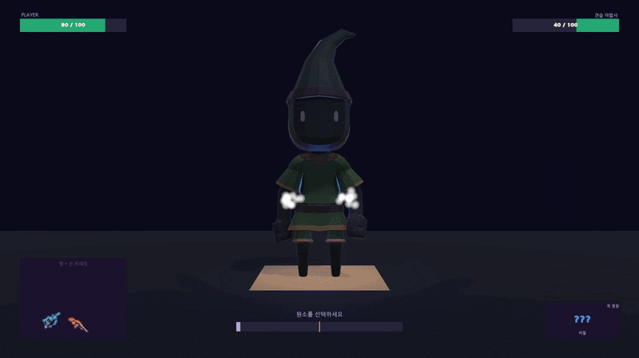

# 마법사 결투 (Wizard Duel)

웹캠 손 모션으로 4원소 마법을 영창하고, 로컬 LLM 라이벌과 심리전 결투를 벌이는 1인칭 PC 게임

> 🏆 **멋쟁이사자처럼 로켓단 인턴십 단독 프로젝트 (2026.04 ~ 05) — 우수 인턴 선정**

📔 **[프로젝트 상세 문서 (Notion)](https://familiar-manx-10d.notion.site/notion)** — 플레이 영상, 시스템 설계, 문제 해결 과정 전체

---

## 프로젝트 정보

| 항목 | 내용 |
|---|---|
| 장르 / 플랫폼 | 전략 대전 · PC |
| 기간 / 인원 | 2026.04 ~ 05 (약 1개월) / 1인 (설계·구현 AI 협업) |
| 핵심 기술 | Unity, MediaPipe(손 트래킹), 로컬 LLM(Qwen 2B), FSM |

> ⚠️ 이 레포는 **코드 중심 포트폴리오**입니다. 에셋·씬은 라이선스/용량 문제로 제외되어 빌드는 불가하며, 회사 허가하에 일부 파일을 제외하고 공개했습니다. 실제 플레이 모습은 노션의 영상으로 확인해주세요.

---

## 핵심 구현

- **영창 시스템 (FSM)** — Idle → Element → Form → Casting의 명확한 단계 전이. 자세가 풀려도 누적 시간을 유지해 조작감 확보, FormCharging 중 원소 변경 허용
- **모션캡처 입력 안정화** — MediaPipe 출력을 게임 입력으로 변환하는 안정화 레이어를 직접 설계 (아래 '대표 문제 해결')
- **로컬 LLM 라이벌** — 라이벌 3명의 페르소나별 실시간 대사 생성. 비동기 호출 → 3초 타임아웃 → 실패 시 JSON 폴백 대사 자동 전환 (7개 상황 트리거 × 3 페르소나)
- **데미지 판정 분리** — `DamageCalculator`를 정적 클래스의 순수 함수로 분리. 입력에만 의존해 결과가 결정되므로 테스트·확장 용이

## 대표 문제 해결 — 웹캠 인식 깜빡임(jittering)

- **현상**: 손 트래킹이 한 프레임씩 깜빡여 영창이 끊김
- **원인**: 손 감지 true/false를 그대로 상태에 반영 → 순간적 인식 소실에도 상태가 무너짐
- **해결**: **비대칭 디바운싱** — 인식(true)은 즉시 반영해 반응성 확보, 소실(false)은 20프레임 연속 확인 후 처리해 안정성 확보
- **근거**: 임계값 20프레임은 직접 테스트로 결정 — 10프레임은 깜빡임이 남고, 30프레임은 안정적이지만 과함. "켜질 때 빠르게, 꺼질 때 신중하게"

📄 코드: [`HandRecognizer.cs`](Assets/02.%20Scripts/Hand/HandRecognizer.cs)

## 기술 선택 근거

| 선택 | 이유 |
|---|---|
| 로컬 LLM (Qwen 2B) | 오프라인·저사양 구동 필요 — 클라우드 API 대비 비용·지연·오프라인 가능성 비교 후 채택 |
| FSM | 영창 단계가 명확히 나뉘고 전이 조건이 분명 → 상태머신이 자연스러움 |
| 정적 클래스 (DamageCalculator) | 판정 로직을 순수 함수로 분리 → 테스트·멀티 확장 용이 |
| LLM JSON 폴백 | AI 실패·지연을 "예외"가 아닌 **기본 시나리오**로 보고 폴백을 미리 설계 |

## 주요 코드 안내

| 파일 | 내용 |
|---|---|
| `HandRecognizer.cs` | 비대칭 디바운싱 — 입력 안정화 |
| `BattleManager.cs` | 영창 상태머신 |
| `DamageCalculator.cs` | 순환 상성 데미지 판정 (순수 함수) |
| `PersonaManager.cs` | 로컬 LLM 호출 + 타임아웃 + JSON 폴백 |

---

📱 **Contact** — 000525jh@gmail.com · [전체 포트폴리오 (Notion)](https://familiar-manx-10d.notion.site/notion)
